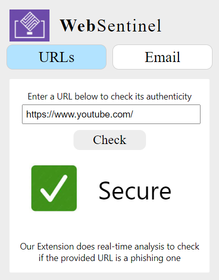
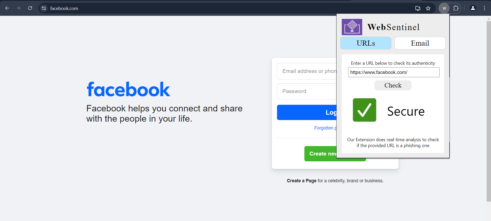
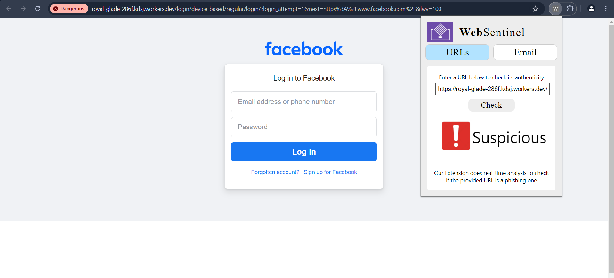
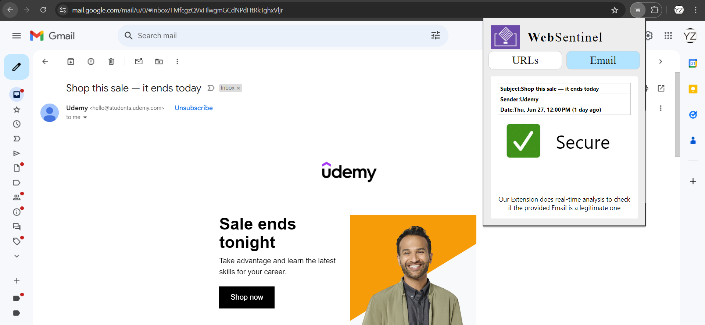
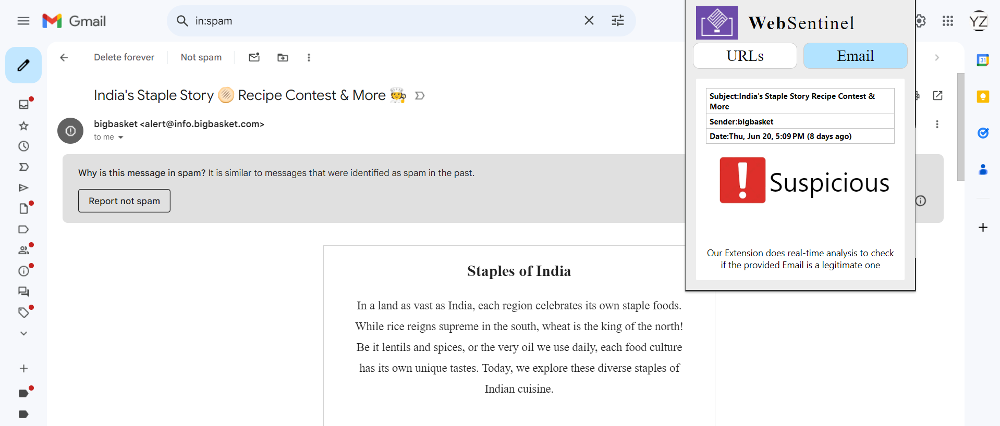

# Phishing Detection Extension

### About
The research introduces an innovative ML-driven system designed to combat phishing attacks and malicious emails. It uniquely adopts a comprehensive approach, encompassing dataset collection, preprocessing, ML model development, and a user-friendly browser extension interface. Achieving so by facilitating the process of identifying phishing URLs through XGBoost and detecting malicious email content using Multinomial Naive Bayes, it exemplifies heightened cybersecurity protocols. The dataset mirrors diverse phishing scenarios, guided by thorough Exploratory Data Analysis (EDA). The XGBoost model utilizes URL features for precise phishing website identification, while the Multinomial Naive Bayes excels in discerning malicious email content. Implemented as a browser extension, the graphical user interface ensures seamless integration into users' digital landscapes, enabling immediate feedback on encountered threats for swift mitigation and user awareness.

The study presents a machine learning-based system to mitigate malicious emails and phishing attempts. It utilizes a thorough methodology that includes gathering datasets, preprocessing, creating ML models, and creating an intuitive browser extension interface. The system detects malicious email content with 98.6% accuracy and phishing URLs with 96.4% accuracy. This same seamless integration of the graphical user interface into users' digital environments is implied.


### To Run
Build the frontend
```bash
cd frontend
npm run build
```
Load the extension in Chrome
1) Open Chrome and navigate to chrome://extensions/.
2) Enable "Developer mode" in the top right corner.
3) Click "Load unpacked" and select the build folder that was created.
4) The extension will now be added to Chrome.


*The backend is already deployed and integrated. However, if you want to run the backend locally, follow these steps:*
```bash
# in another terminal
cd backend
pip install -r requirements.txt
python app.py
#(make sure to change the routes in the frontend)
```

### Outcome





 

 

 


